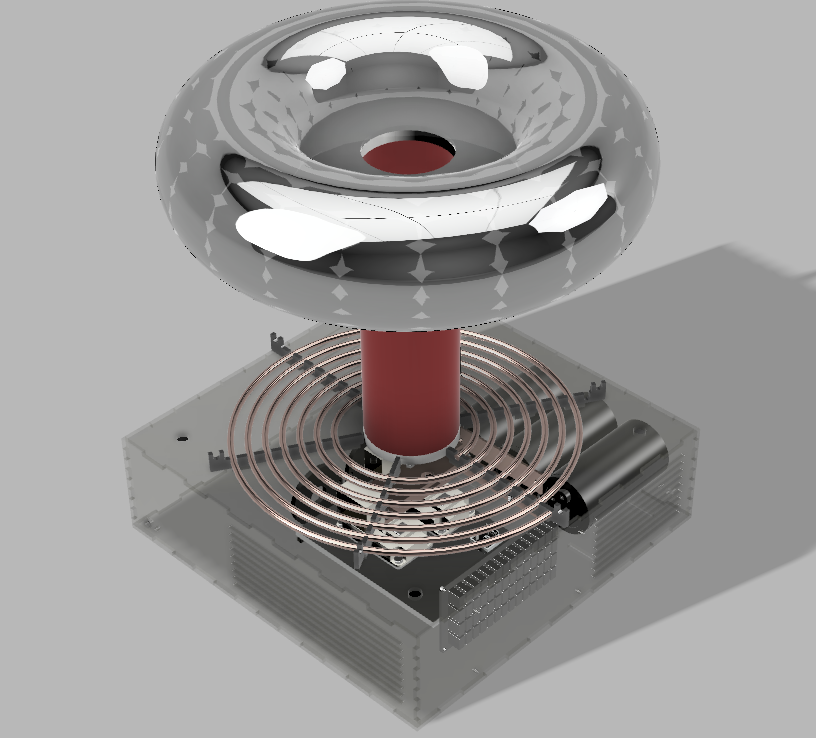

### Robot Gladiator DRSSTC!

A battery powered dual resonant solid state Tesla coil. Pulse skip interrupter, with functionality up to 500A.
- "laminated" bus design for low inductance and high power operation
- resonant frequency of 120kHz
- 4.5in x 16in secondary coil, primary inductance ~ 12uH
- 0.1458uF MMC bank

### images

Full CAD model

Interior acrylic housing

